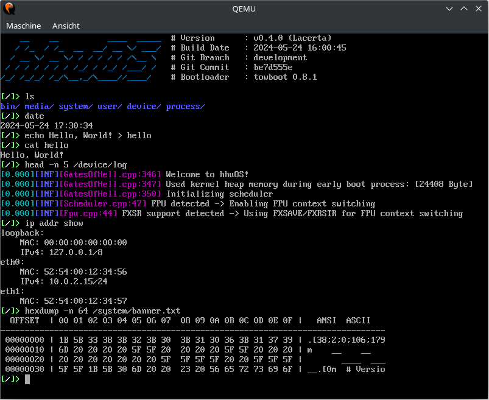
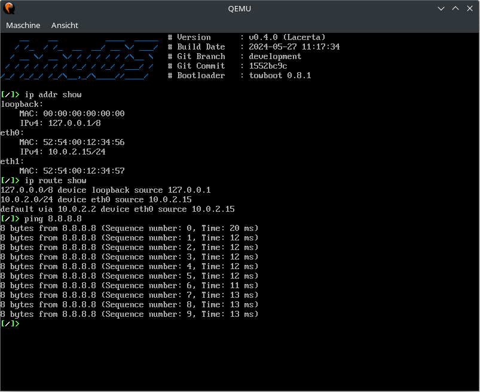
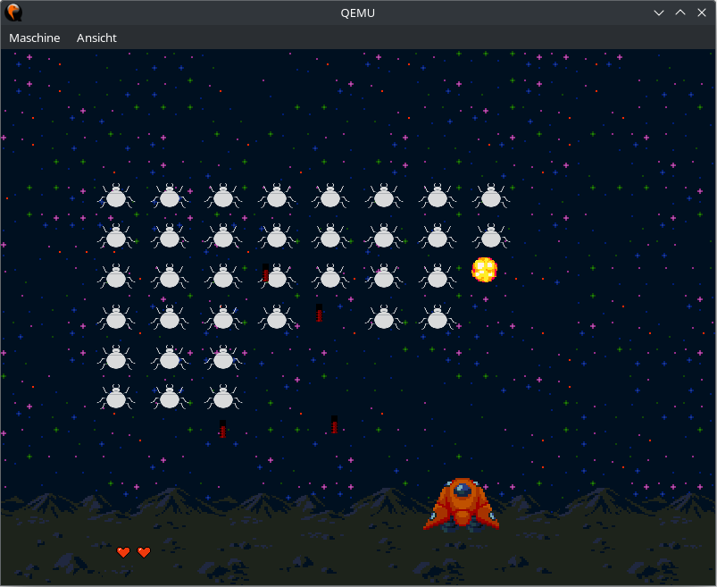
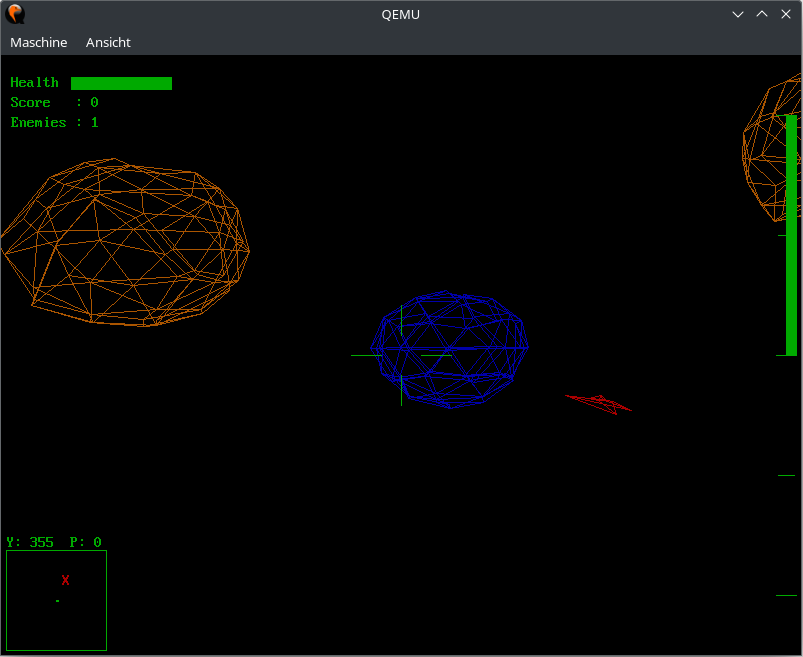
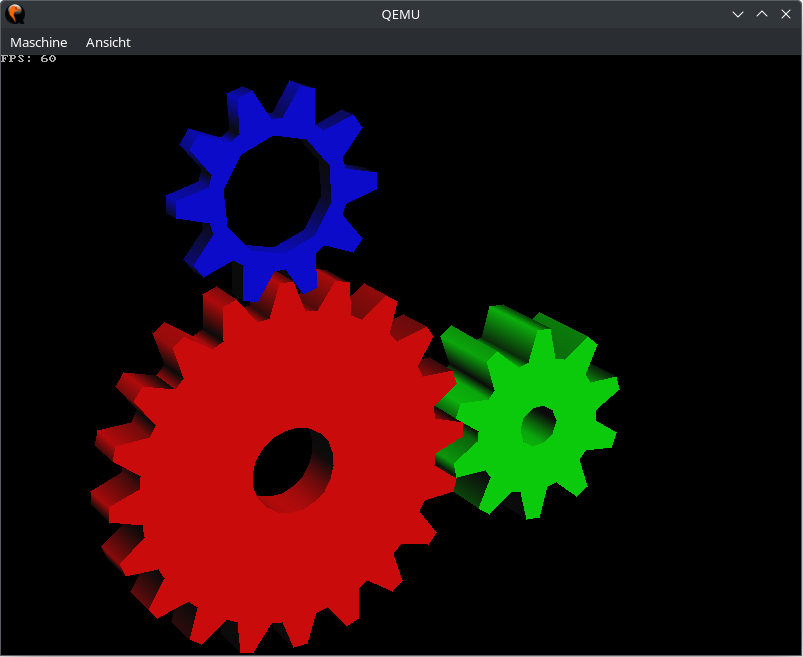
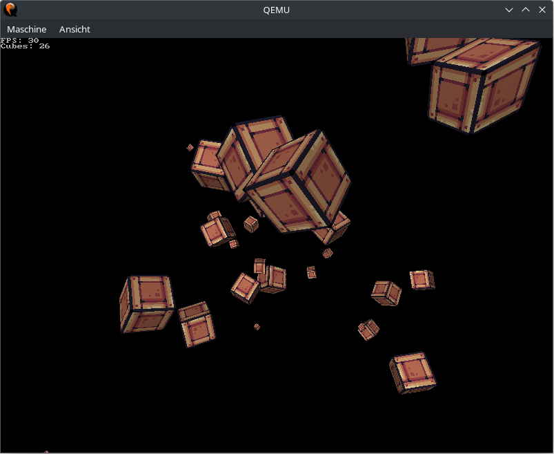

# hhuOS

<p align="center">
  
</p>

<p align="center">
  <a href="https://github.com/hhuOS/hhuOS/actions/workflows/build.yml"></a>
  
  
</p>

## Introduction

Welcome to hhuOS, a **small operating system** written in C++ and Assembler for the x86-architecture. The main purpose of this project is to show how different aspects of operating systems theory can be implemented and linked together. The system is *not* aimed to be a full-featured operating system for daily use.

This is a project by the [Operating Systems group](https://www.cs.hhu.de/en/research-groups/operating-systems.html) at the *Heinrich Heine University Düsseldorf*.

<p align="center">
  <a href="https://www.uni-duesseldorf.de/home/en/home.html"></a>
</p>

## Run without building

We provide nightly builds of our `master` and `development` branches via [GitHub Releases](https://github.com/hhuOS/hhuOS/releases). Execute the following commands to download and run the latest `master` build in QEMU (on Ubuntu 22.04):

```shell
sudo apt install wget qemu-system-x86
mkdir -p hhuOS
cd hhuOS
wget https://github.com/hhuOS/hhuOS/releases/download/nightly-master/hhuOS-master.tar.gz
tar -xzf hhuOS-master.tar.gz
./run.sh
```

The OS will boot into a shell with some UNIX-like commands. Run `ls /bin` to see all available applications. Try out `bug` and `battlespace` for some old-fashioned games!

<p align="center">
  
</p>

If QEMU hangs on a black screen, try executing `./run.sh --bios true --file hhuOS-limine.iso`. There seems to be a problem with older QEMU versions and new OVMF images.

## Build from source

GCC (compatible with C++20), CMake (>=3.14) and some other dependencies are required to compile hhuOS. To install them, you can run the following command (on Ubuntu 22.04):

```shell
sudo apt install build-essential nasm gcc-multilib g++-multilib cmake libgl-dev python3 python3-distutils xorriso dosfstools mtools unzip wget ffmpeg git recode
```

Afterward, clone this repository and execute the included build-script:

```shell
git clone https://github.com/hhuOS/hhuOS.git
git submodule update --init --recursive
cd hhuOS
./build.sh
```

To test hhuOS in QEMU, simply execute the included run-script:

```shell
./run.sh
```

If QEMU hangs on a black screen, try building an image with [Limine](https://github.com/limine-bootloader/limine) bootloader and then running QEMU with a classic BIOS:
```
./build.sh --target limine
./run.sh --bios true --file hhuOS-limine.iso
```
There seems to be a problem with older QEMU versions and new OVMF images.

## What next?

Congratulations! If you have made it this far, you have successfully compiled and run hhuOS! If you have not done so yet, you should definitely try out the included games `bug`, `battlespace` and `dino`, as well as the `demo` command, to see the capabilities of our user space game engine.

When you are done tinkering with the OS, why not try to build your own application for hhuOS? Our [wiki](https://github.com/hhuOS/hhuOS/wiki/) provides tutorials on how to set up a development environment and get started with app development for hhuOS.

## Screenshots

<table style="margin-left: auto; margin-right: auto">
    <tr>
        <td>
        </br>
        <p align="center">Demonstration of some shell commands in hhuOS</p>
        </td>
        <td></br>
        <p align="center">Network stack demo</p>
        </td>
    </tr>
    <tr>
        <td></br>
        <p align="center"><i>Bug Defender</i> is a Space Invaders clone</p>
        </td>
        <td></br>
        <p align="center"><i>Battlespace</i> is a 3D space shooter</p>
        </td>
    </tr>
    <tr>
        <td></br>
        <p align="center">The classic <i>gears</i> demo using <a href="https://github.com/C-Chads/tinygl">TinyGL</a></p>
        </td>
        <td></br>
        <p align="center">Rotating textured cubes using <a href="https://github.com/C-Chads/tinygl">TinyGL</a></p>
        </td>
    </tr>
</table>

## Notes

Assets for the dino game have been taken from [itch.io](https://itch.io):
 - [Dino Characters](https://arks.itch.io/dino-characters) by [*@ScissorMarks*](https://twitter.com/ScissorMarks) ([CC BY 4.0](https://creativecommons.org/licenses/by/4.0/legalcode))
 - [Dino Family](https://demching.itch.io/dino-family) by [*DemChing*](https://demching.itch.io/) ([CC BY 4.0](https://creativecommons.org/licenses/by/4.0/legalcode))
 - [Pixel Adventure](https://pixelfrog-assets.itch.io/pixel-adventure-1) by [*Pixel Frog*](https://pixelfrog-assets.itch.io/) ([CC0 1.0](https://creativecommons.org/publicdomain/zero/1.0/legalcode))
 - [Pixel Platformer](https://kenney-assets.itch.io/pixel-platformer) by [*Kenney*](https://kenney-assets.itch.io/) ([CC0 1.0](https://creativecommons.org/publicdomain/zero/1.0/legalcode))
 - [Retro Cloud Tileset](https://ohnoponogames.itch.io/retro-cloud-tileset) by [*ohnoponogames*](https://ohnoponogames.itch.io/)

Assets for the bug defender game have been taken from [itch.io](https://itch.io):
- [Lunar Battle Pack](https://mattwalkden.itch.io/lunar-battle-pack) by [*MattWalkden*](https://mattwalkden.itch.io/) ([CC0 1.0](https://creativecommons.org/publicdomain/zero/1.0/legalcode))
- [Pixel Heart Animation](https://nicolemariet.itch.io/pixel-heart-animation-32x32-16x16-freebie) by [*Nicole Marie T*](https://nicolemariet.itch.io/)

Assets for the battlespace game have been taken from [itch.io](https://itch.io):
- [Lowpoly - 3D Space Assets Pack](https://ejgarner118.itch.io/spacepack) by [*ejgarner118*](https://ejgarner118.itch.io/)

3D-demo assets haven been taken from [itch.io](https://itch.io):
- [M1 Tank](https://alstrainfinite.itch.io/m1-tank) by [*Alstra Infinite*](https://alstrainfinite.itch.io/) ([CC BY 4.0](https://creativecommons.org/licenses/by/4.0/legalcode))
- [Shark](https://alstrainfinite.itch.io/fish) by [*Alstra Infinite*](https://alstrainfinite.itch.io/) ([CC BY 4.0](https://creativecommons.org/licenses/by/4.0/legalcode))
- [Plane](https://alstrainfinite.itch.io/planes) by [*Alstra Infinite*](https://alstrainfinite.itch.io/) ([CC BY 4.0](https://creativecommons.org/licenses/by/4.0/legalcode))
- [Coffee Maker](https://alstrainfinite.itch.io/kitchen-appliance-2) by [*Alstra Infinite*](https://alstrainfinite.itch.io/) ([CC BY 4.0](https://creativecommons.org/licenses/by/4.0/legalcode))

Assets for the mouse demo haven been taken from [Icons8](https://icons8.com/).

Music for the SoundBlaster demo has been taken from [Bensound](https://www.bensound.com/royalty-free-music):
- Ukulele license code: 3M7PXYPYNOTSIGNQ

## Ported software:

Doom has been ported to hhuOS using [doomgeneric](https://github.com/ozkl/doomgeneric) by [*ozkl*](https://github.com/ozkl/) ([GPLv2](https://github.com/ozkl/doomgeneric/blob/master/LICENSE))
- Available as `doom` command in hhuOS.
- Prebuilt versions of hhuOS on [GitHub Releases](https://github.com/hhuOS/hhuOS/releases) do not include a WAD file. If you want to play Doom, build hhuOS from source. The shareware WAD file will be downloaded automatically.

Quake has been ported to hhuOS using [quakegeneric](https://github.com/erysdren/quakegeneric) by [*erysdren*](https://github.com/erysdren/) ([GPLv2](https://github.com/erysdren/quakegeneric/blob/master/LICENSE))
- Available as `quake` command in hhuOS.
- Prebuilt versions of hhuOS on [GitHub Releases](https://github.com/hhuOS/hhuOS/releases) do not include a PAK file. If you want to play Quake, build hhuOS from source. The shareware PAK file will be downloaded automatically.

[TinyGL](https://github.com/C-Chads/tinygl) by [*C-Chads*](https://github.com/C-Chads/) ([License](https://github.com/C-Chads/tinygl/blob/main/LICENSE))
- Try out the `tinygl` command in hhuOS for some demos.

[PortableGL](https://github.com/rswinkle/PortableGL) by [*rswinkle*](https://github.com/rswinkle/) ([MIT](https://github.com/rswinkle/PortableGL/blob/master/LICENSE))
- Try out the `portablegl` command in hhuOS for some demos.

[Peanut-GB](https://github.com/deltabeard/Peanut-GB) by [*deltabeard*](https://github.com/deltabeard) ([MIT](https://github.com/deltabeard/Peanut-GB/blob/master/peanut_gb.h)):
- Available as `peanut-gb` command in hhuOS.
- Joypad is mapped to WASD; A and B are mapped to K and J; Start is mapped to Space and Select is mapped to Enter. Use 'F1' and 'F2' to adjust screen scaling. Use 'F3' to cycle through color palettes and 'F4' to reset to default palette.
- Place your own ROM files in `disk/hdd0/user/gameboy/` before building hhuOS to include them in the HDD image.
- The following games are included in `/user/gameboy/`:
  - [2048-gb](https://github.com/Sanqui/2048-gb) by [*Sanqui*](https://github.com/Sanqui) ([zlib](https://github.com/Sanqui/2048-gb/blob/master/LICENSE))
  - [5 Mazes](https://github.com/godai78/5-Mazes/) by [*godai78*](https://github.com/godai78) ([MIT](https://github.com/godai78/5-Mazes/blob/main/LICENSE))

[clownmdemu](https://github.com/Clownacy/clownmdemu) by [*Clownacy*](https://github.com/Clownacy) ([GNU AGPLv3](https://github.com/Clownacy/clownmdemu/blob/master/LICENCE.txt)):
- Available as `clownmdemu` command in hhuOS.
- Joypad is mapped to arrow keys; ABC and XYZ buttons are mapped to A, S, D and Y(Z), X, C respectively; Start is mapped to Space and Mode is mapped to Enter. Use 'F1' and 'F2' to adjust screen scaling. Use 'F3' to cycle through color palettes and 'F4' to reset to default palette.
- Place your own ROM files in `disk/hdd0/user/megadrive/` before building hhuOS to include them in the HDD image.
- The following games are included in `/user/megadrive/`:
  - [Dragon's Castle](https://github.com/sikthehedgehog/dragon) by [*sikthehedgehog*](https://github.com/sikthehedgehog/) ([zlib](https://github.com/sikthehedgehog/dragon/blob/master/LICENSE))
  - [Miniplanets](https://github.com/sikthehedgehog/miniplanets) by [*sikthehedgehog*](https://github.com/sikthehedgehog/) ([zlib](https://github.com/sikthehedgehog/miniplanets/blob/master/LICENSE.txt))
