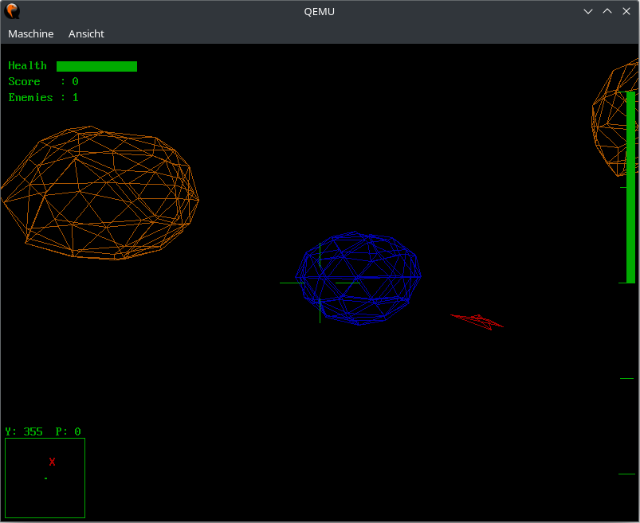

Battle Space
=====
A 3D space shooter game.

Usage
-----
```
battlespace [OPTION]...
```

Supported options:
 * -r, --resolution WIDTHxHEIGHT\@BPP: Set the display resolution before starting the game (may not have any effect depending on the display driver).
 * -s, --scale SCALE: A floating point number in (0,1] used to scale the game.
   The game is rendered internally at the lower-scaled resolution and then scaled up to the actual resolution
   (e.g., a scale of 0.5 will cause the game to be rendered at half the actual resolution).
   This option can help with performance on low-end devices.
 * -h, --help: Show this help message and exit.

You control a spaceship in first-person view.
Your goal is to survive as long as possible, destroying enemy ships with your missiles.
Use the radar on the lower left to locate enemies.

Controls:
 * Arrow Keys: Control the direction of your ship.
 * WASD: Strafe the ship.
 * Q/E: Accelerate/decelerate the ship.
 * Space: Fire a missile.

Examples
--------
