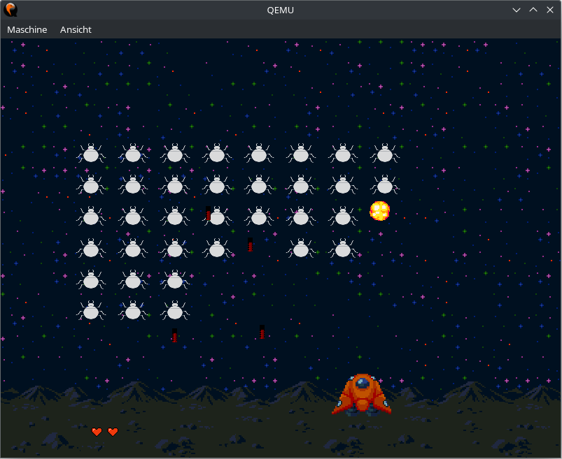

Bug Defender
=====
A Space Invaders clone.

Usage
-----
```
bug [OPTION]...
```

Supported options:
 * -r, --resolution WIDTHxHEIGHT@BPP: Set the display resolution before starting the game (may not have any effect depending on the display driver).
 * -s, --scale SCALE: A floating point number in (0,1] used to scale the game.
   The game is rendered internally at the lower-scaled resolution and then scaled up to the actual resolution
   (e.g., a scale of 0.5 will cause the game to be rendered at half the actual resolution).
   This option can help with performance on low-end devices.
 * -h, --help: Show this help message and exit.

You control the spaceship at the bottom of the screen.
Your goal is to destroy all enemy bugs before they reach the planet.
Your remaining lives are displayed in the bottom-left corner of the screen.
You are not allowed to fire more than one missile at a time.
Once you have fired a missile, the next one can only be fired after the previous one is destroyed or leaves the screen.

Controls:
 * Left/Right Arrow Keys: Move your ship.
 * Space: Fire a missile.

Examples
--------
