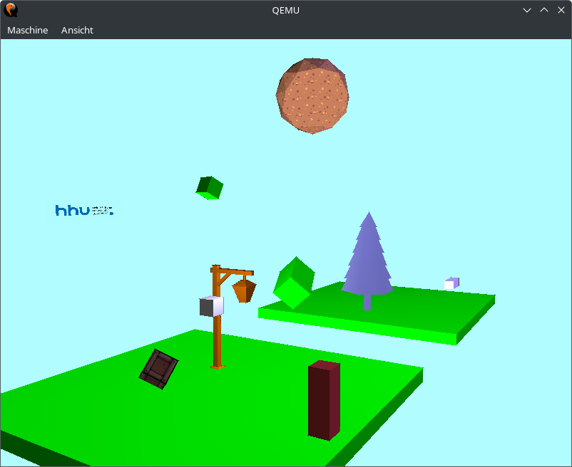
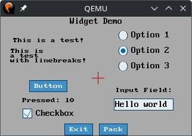

demo
=====
A demo application that showcases various graphical capabilities of the OS.

Usage
-----
```
demo [OPTION]... DEMO
```

Supported options:
 * -h, --help: Show this help message and exit.

The following DEMOs are supported:
 * `ant`: An implementation of "Langton's ant" moving on the screen.
 * `color`: A demo that showcases the ANSI color code implementation of the terminal.
 * `font`: A demo that showcases the builtin fonts.
 * `keyboard`: A demo that reads key events and prints information about each on to standard out.
 * `opengl`: A 3D demo scene using the Pulsar game engine.
 The user can move around freely in the rendered scene using the arrow keys. and WASD.
 * `particles`: A demo that showcases the 2D particle system of the Pulsar game engine.
 * `polygons`: A demo that renders rotating and scaling 2D polygons using the Pulsar game engine.
 Press `+` to add a polygon and `-` to remove the last polygon.
 * `sprites`: A demo that renders rotating and scaling animated 2D sprites using the Pulsar game engine.
 Press `+` to add a sprite and `-` to remove the last sprite.
 * `widgets`: A demo that showcases the Lunar widget library for building user interfaces.

Every demo can be exited by pressing the Escape key.

Examples
--------

