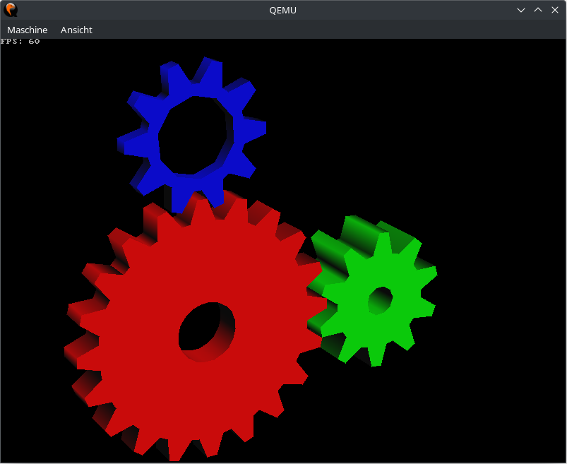
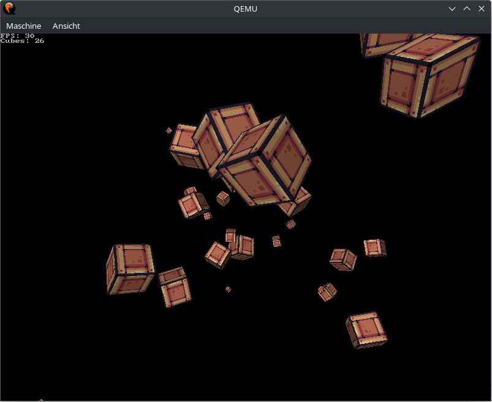

tinygl
=====
TinyGL demo application.

Usage
-----
```
tinygl [OPTION]... DEMO
```

Supported options:
* -r, --resolution WIDTHxHEIGHT@BPP: Set the display resolution before starting the demo (may not have any effect depending on the display driver).
* -s, --scale SCALE: A floating point number in (0,1] used to scale the demo.
  The demo is rendered internally at the lower-scaled resolution and then scaled up to the actual resolution
  (e.g., a scale of 0.5 will cause the demo to be rendered at half the actual resolution).
  This option can help with performance on low-end devices.
* -h, --help: Show this help message and exit.

This application uses the [TinyGL](https://github.com/C-Chads/tinygl) library to render OpenGL demos.

Supported demos:
* info: Show OpenGL information.
* triangle: Render a rotating triangle with color blending.
* gears: Render spinning gear wheels, similar to the famous `glxgears` application.
* cubes: Render rotating textured cubes. Use the `+` and `-` keys to increase/decrease the number of cubes.
* lesson1: Render static 2D shapes (Lesson 1 of the OpenGL tutorial on [videotutorialsrock.com](https://videotutorialsrock.com/)).

Examples
--------

### Gears Demo:


### Cubes Demo:

